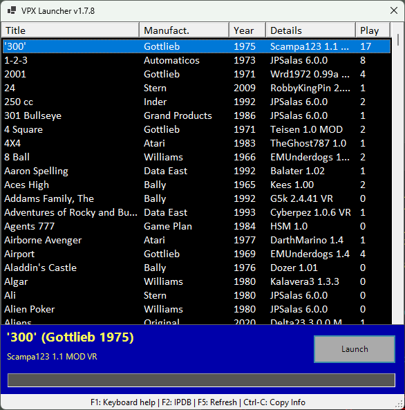

# Visual Pinball X Launcher

 Super simple launcher, designed primarily for my *desktop PC* pinball playing needs.  Might add stuff (machine preview) later.

 Defaults assume that this script and the CSV file are in the "root" of the Visual Pinball folder, i.e. where "VPinballX64.exe" is located, and with subfolders "Tables" and "VPinMAME" in it.

## Screenshot

## Installation

Download and copy `vpx_launcher.ps1` to your "Visual Pinball" root folder and run it.  That's about it!

## Notes

* Click on headers to sort by that column.
* Type to search for a specific table.
