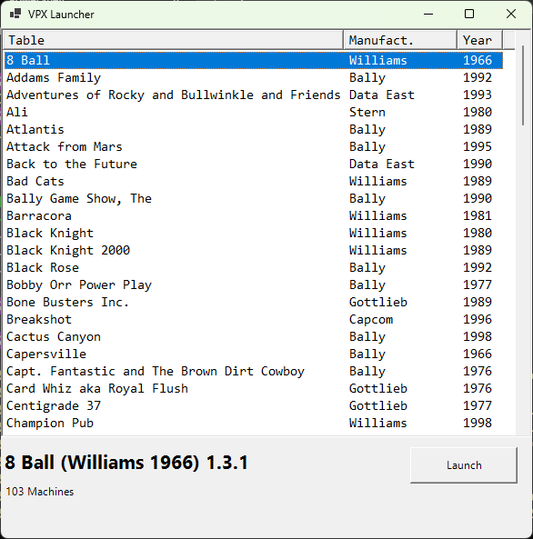

# Visual Pinball X Launcher

 Super simple launcher, designed primarily for my *desktop PC* pinball playing needs.  Might add stuff (machine preview) later.

 Defaults assume that this script and the CSV file are in the "root" of the Visual Pinball folder, i.e. where "VPinballX64.exe" is located, and with subfolders "Tables" and "VPinMAME" in it.

Notes:

* "vpx_launcher.csv" contains the metadata for tables, but is optional.  Filenames are parsed to try to determine name, manufacturer and year.
* Click on headers to sort by that column.
