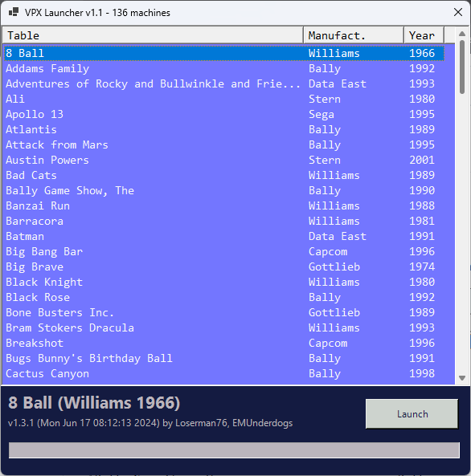

# Visual Pinball X Launcher

 Super simple launcher, designed primarily for my *desktop PC* pinball playing needs.  Might add stuff (machine preview) later.

 Defaults assume that this script and the CSV file are in the "root" of the Visual Pinball folder, i.e. where "VPinballX64.exe" is located, and with subfolders "Tables" and "VPinMAME" in it.

<<<<<<< HEAD

=======

>>>>>>> 7d8c8e22c8b8bc5b2be1572f1ca87f0ffa32b5a3

Notes:

* Click on headers to sort by that column.
