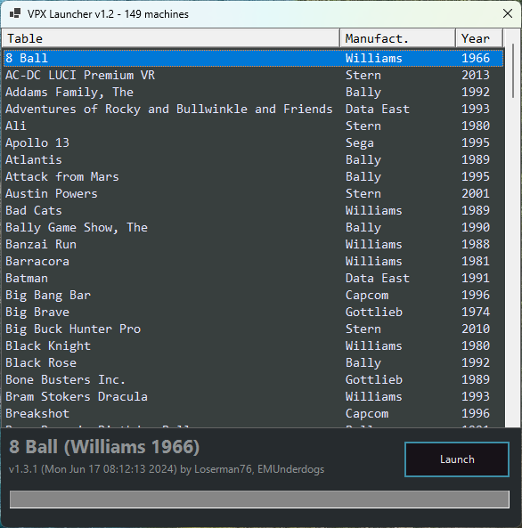

# Visual Pinball X Launcher

 Super simple launcher, designed primarily for my *desktop PC* pinball playing needs.  Might add stuff (machine preview) later.

 Defaults assume that this script and the CSV file are in the "root" of the Visual Pinball folder, i.e. where "VPinballX64.exe" is located, and with subfolders "Tables" and "VPinMAME" in it.

## Screenshot



## Installation

Download and copy `vpx_launcher.ps1` to your "Visual Pinball" root folder and run it.  That's about it!

## Update Checker

I've also created an update checker for Visual Pinball X and VPinMame. Just run "UpdateCheck.ps1" and provide it the path to your binaries. If a newer version is available,
the location to download it from will be shown.

```PowerShell
> .\UpdateCheck.ps1 -Path 'D:\Visual Pinball\'
```

```text
Visual Pinball X:
Local version:  v10.8.0.2015.6f63503 (D:\Visual Pinball\VPinballX64.exe)
Online version: v10.8.0.2015.6f63503
Latest version installed.

Visual PinMAME:
Local version:  v3.6.0.1122.79a301d (D:\Visual Pinball\VPinMAME\VPinMAME64.dll)
Online version: v3.6.0.1122.79a301d
Latest version installed.
```

## Notes

* Click on headers to sort by that column.
* Type to search for a specific table.
* If you get a "running scripts is disabled on this system" error when launching, use the command `Set-ExecutionPolicy -ExecutionPolicy Unrestricted -Scope CurrentUser -Force`.
